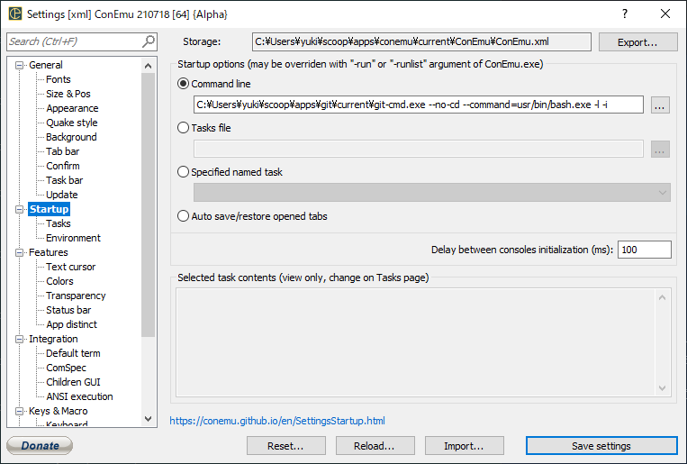
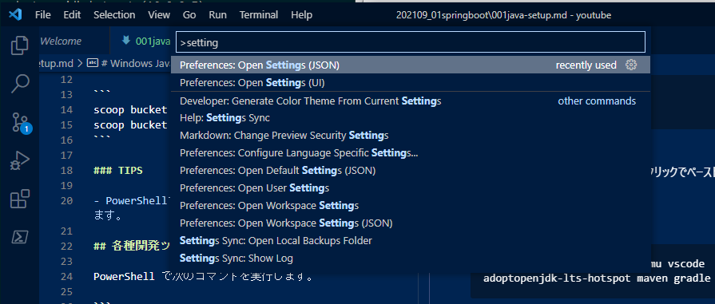

# Windows Java開発環境セットアップ

## [Scoop](https://scoop.sh/) インストール

Windowsメニューから "Windows PowerShell" を起動し、次の2コマンドを実行します。
```
Set-ExecutionPolicy RemoteSigned -scope CurrentUser
iwr -useb get.scoop.sh | iex
```

続いて、`extras`, `java`バケットを追加します。バケット追加には `git` パッケージのインストールが必要なので、先んじて `git` もインストールします。

```
scoop install git
scoop bucket add extras
scoop bucket add java
```

### TIPS

- PowerShellプロンプト上では、右クリックでペーストできます。

## 各種開発ツールインストール

PowerShell で次のコマンドを実行します。

```
scoop install pwsh conemu vscode adopt11-hotspot maven gradle
```

### TIPS

- ここでインストールしている Maven や Gradle は、 Spring Boot を開発する際には必須ではありません(Spring Boot には必要に応じてダウンロードする仕組みがある)が、一般的な Java 開発を行う場合には必要なのでここでインストールしています。
- `adopt11-hotspot` としてインストールしているJDKは、 [Adoptium](https://adoptium.net/) と呼ばれているものです。これは、以前の [AdoptOpenJDK](https://adoptium.net/faq.html#AdoptOpenJDK) に相当するディストリビューションです。
- Java系ツールに特化した [SDKMAN!](https://sdkman.io/) というパッケージマネージャもあり、 JDK 等はこちらでインストールすることもあります。ただ、あまり Windows のことは考慮されていないので少しコツが必要になります。
  - 具体的には、[内部でシンボリックリンクを利用しているのでその考慮が必要になります](https://github.com/sdkman/sdkman-cli/issues/593#issuecomment-467767923)。

## ConEmu セットアップ

参考: https://conemu.github.io/en/GitForWindows.html

メニューから **Settings** を開き、 **Startup** メニュー内の **Command line** に次の通り記入します(`git-cmd.exe` のパスは実際のものを入力してください):

```
C:\Users\yuki\scoop\apps\git\current\git-cmd.exe --no-cd --command=usr/bin/bash.exe -l -i
```



## VSCode セットアップ

VSCode 上で `Ctrl+Shift+P` キーを押すと[コマンドパレット](https://code.visualstudio.com/docs/getstarted/userinterface#_command-palette)が開きます。

ここで "settings" と入力すると候補を絞り込めますので、 "**Preferences: Open Settings(JSON)**" を選択します。



`settings.json` というファイルが開きますので、次の内容をコピー&ペーストします:

```json
{
  "files.encoding": "utf8",
  "files.eol": "\n",
  "editor.formatOnSave": true,
  "editor.minimap.enabled": false,
  "window.title": "${dirty}${activeEditorMedium}${separator}${rootName}",
}
```

### TIPS

- 設定の説明は次のページにあります:
  - https://code.visualstudio.com/docs/getstarted/settings

## Git セットアップ

Git Bash(ConEmu) を開き、次のコマンドを入力します(`user.name`, `user.email` は自身のものを入力します):

```
git config --global user.name "your name"
git config --global user.email "your.email@example.com"
git config --global core.autocrlf false
git config --global core.quotepath false
git config --global pull.ff only
git config --global gui.encoding utf-8
git config --global credential.helper manager-core
git config --global branch.sort authordate
git config --global submodule.recurse true
git config --global alias.logshort 'log --pretty=format:"%h %an %ai %s"'
```

### TIPS

- 設定情報は次のコマンドで確認できます:
  - `git config -l --show-origin`
- コンフィグの説明は次のページにあります:
  - https://git-scm.com/docs/git-config#_variables

## Spring Tools 4 for Eclipse(STS) インストール & セットアップ

https://spring.io/tools から Spring Tools 4 for Eclipse をダウンロードします。

Git Bash(ConEmu) を開いて次のコマンドを実行し、ダウンロードしたファイルを `~/Documents/opt` ディレクトリに展開します(3行目は実際にダウンロードしたファイル名を指定してください):

```
mkdir ~/Documents/opt
cd ~/Documents/opt
java -jar ~/Downloads/spring-tool-suite-4-4.11.1.RELEASE-e4.20.0-win32.win32.x86_64.self-extracting.jar
```

同じくGit Bash で次のコマンドを入力し、設定ファイルが格納されたリポジトリをチェックアウトします:
```
mkdir ~/Documents/repos
cd ~/Documents/repos
git clone https://github.com/yukihane/prefs.git
```

STSを起動し、次の操作を行います:

1. メニューから **File > Import** を選択します。
1. **General > Preferences** を選択します。
1. 上でチェックアウトしたリポジトリの [`eclipse/eclipse.epf`](https://github.com/yukihane/prefs/blob/master/eclipse/eclipse.epf) を選択します。
1. STSの再起動を促されるので指示に従います。
1. 再起動したら、メニューから **Window > Preferences** を選択します。
1. ツリーメニューから **Java > Code Style > Formatter** を選択します。
1. **Import** を選択し、上でチェックアウトしたリポジトリの [`eclipse/java-format-setting.xml`](https://github.com/yukihane/prefs/blob/master/eclipse/java-format-setting.xml) を選択します。
1. **Active profile** が "custom" になっていることを確認して **Apply and Close** でダイアログを閉じます。

続いて、Lombokをインストールします:

1. STS を終了させます。
1. https://projectlombok.org/download から `lombok.jar` をダウンロードします。
1. `java -jar ~/Downloads/lombok.jar` コマンドを実行し、インストーラを起動します。
1. `SpringToolSuite4.exe` の場所を指定してインストール実行します。
